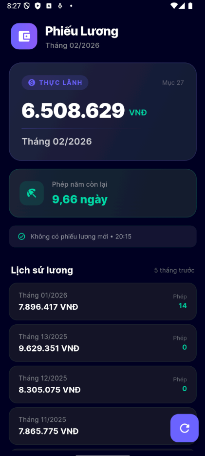

# XemLuong - Ứng dụng Quản lý Phiếu Lương Tự Động

**XemLuong** là một ứng dụng di động được xây dựng bằng Flutter, giúp bạn tự động hóa việc theo dõi thu nhập và ngày phép hàng tháng bằng cách quét email từ hòm thư cá nhân.



## 🚀 Tính năng nổi bật

- **Tự động quét Email**: Kết nối với Gmail (qua giao thức IMAP) để tìm các email phiếu lương từ người gửi được cấu hình.
- **Trích xuất dữ liệu bằng AI (OCR)**: Sử dụng Google ML Kit để nhận diện văn bản từ ảnh phiếu lương (Net Salary, Phép năm còn lại).
- **Giao diện Premium**: Thiết kế hiện đại với chế độ Dark Mode, hiệu ứng Glassmorphism và các micro-animations mượt mà.
- **Xử lý thông minh**: 
  - Hỗ trợ các phiếu lương đa dạng định dạng (bao gồm ảnh đính kèm, TIFF nhiều trang).
  - Tự động nhận diện và xử lý riêng biệt cho **Tháng 13/Tháng thưởng** (không hiển thị thừa ngày phép).
- **Lưu trữ cục bộ**: Lưu lịch sử lương vào bộ nhớ máy, cho phép xem lại nhanh chóng mà không cần kết nối internet.

## 🛠 Công nghệ sử dụng

- **Flutter & Dart**: Framework phát triển ứng dụng di động.
- **Google ML Kit**: Sử dụng `Text Recognition` để xử lý OCR.
- **Enough Mail**: Thư viện xử lý IMAP để đọc email an toàn.
- **Shared Preferences**: Lưu trữ dữ liệu đơn giản trên thiết bị.
- **Google Fonts**: Phông chữ Inter hiện đại và chuyên nghiệp.

## 📦 Hướng dẫn cài đặt

### 1. Yêu cầu hệ thống
- Flutter SDK: ^3.6.2
- Android SDK: 35 (hoặc mới hơn)
- Gmail App Password (để bảo mật thay vì dùng mật khẩu chính).

### 2. Cấu hình
Mở file `lib/salary_service.dart` và cập nhật thông tin email của bạn:
```dart
static const String mailEmail = 'your-email@gmail.com';
static const String mailPassword = 'your-app-password'; 
static const String expectedSender = 'sender@company.com';
```

### 3. Chạy ứng dụng
```bash
flutter pub get
flutter run
```

### 4. Build APK
```bash
flutter build apk --debug
```

## 📝 Nhật ký thay đổi gần đây
- **Sửa lỗi hiển thị phép năm**: Tháng 13/14 hiện hiển thị `--` thay vì các con số nhận nhầm ngẫu nhiên.
- **Tối ưu hóa Regex**: Nhận diện tháng và năm chính xác hơn, tránh nhận nhầm các tháng 01, 11, 12.
- **Cải thiện UI**: Hiển thị trạng thái cập nhật thời gian thực từ mail.

## 🤝 Đóng góp
Nếu bạn có bất kỳ ý tưởng gớp ý nào, hãy tạo một Issue hoặc gửi Pull Request!

---
*Phát triển bởi Antigravity AI Assistant.*
