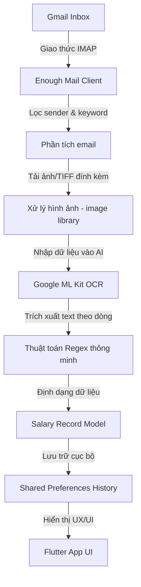

# 💰 XemLuong - Hệ Thống Quản Lý Tiền Lương Thông Minh & Tự Động


## 📖 Tổng Quan Dự Án
**XemLuong** không chỉ là một ứng dụng hiển thị số dư; tháng lương của bạn. Đây là một giải pháp toàn diện giúp người đi làm tự động hóa hoàn toàn quy trình quản lý tài chính cá nhân liên quan đến thu nhập hàng tháng. 

Ứng dụng giải quyết bài toán phiền toái khi phải tìm kiếm thủ công các email phiếu lương (payslips) trong hòm thư Gmail lộn xộn, tải xuống các file ảnh/PDF và tự tay nhập liệu vào các ứng dụng quản lý chi tiêu. Với cơ chế **"Một chạm - Cập nhật tất cả"**, XemLuong mang đến sự tiện lợi tối đa và tính chính xác tuyệt đối.

---

## 🛠 Kiến Trúc Hệ Thống & Nguyên Lý Hoạt Động

Dưới đây là sơ đồ luồng dữ liệu của ứng dụng:



---

## ✨ Các Tính Năng Chi Tiết (Deep-Dive)

### 1. Công nghệ OCR Tối Ưu Cho Bảng Biểu
Khác với các ứng dụng scan văn bản thông thường, XemLuong được tối ưu hóa đặc biệt để đọc cấu trúc bảng lương:
- **Tái cấu trúc hàng (Line Reconstruction)**: Ứng dụng tự động nhóm các từ dựa trên tọa độ Y trên ảnh để đảm bảo dữ liệu cột luôn đi đúng với hàng của nó.
- **Xử lý TIFF đa trang**: Hỗ trợ giải nén các file TIFF nhiều trang (multi-frame) thường thấy trong các hệ thống xuất phiếu lương tự động của doanh nghiệp lớn.
- **Resize thông minh**: Ảnh được tự động điều chỉnh kích thước về 1200px (chiều ngang) để tăng tốc độ nhận diện ML Kit mà không làm giảm độ chính xác.

### 2. Thuật Toán Nhận Diện Tháng Thưởng (Tháng 13/14)
Một trong những điểm mạnh nhất của ứng dụng là khả năng phân tích logic:
- Phân biệt email chứa phiếu lương thường (Tháng 01-12) và phiếu thưởng.
- Tự động gán giá trị `--` cho ngày phép ở các tháng thưởng, đảm bảo biểu đồ và số liệu tổng quát không bị sai lệch bởi các con số nhận diện nhầm từ bảng thưởng.

### 3. Giao Diện Thiết Kế Theo Chuẩn "Premium"
- **Glassmorphism**: Các thẻ con (cards) sử dụng hiệu ứng kính mờ tạo chiều sâu.
- **Dynamic Icons**: Icon thay đổi màu sắc dựa trên nội dung dữ liệu (Net Salary xanh lá, Leave Balance màu ngọc).
- **Smooth Refresh**: Tích hợp `RefreshIndicator` mượt mà kết hợp với `FloatingActionButton` chuyển động động.

---

## 📦 Công Nghệ & Thư Viện Chủ Chốt

### Core Frameworks
- **Flutter Framework (v3.27.4+)**: Tận dụng hiệu năng rendering tuyệt vời của Skia/Impeller.
- **Dart Language**: Ngôn ngữ lập trình hướng đối tượng, an toàn mã nguồn.

### Thư Viện Chuyên Dụng
- [`google_mlkit_text_recognition`](https://pub.dev/packages/google_mlkit_text_recognition): Tận dụng mô hình AI của Google chạy trực tiếp trên thiết bị (On-device).
- [`enough_mail`](https://pub.dev/packages/enough_mail): Thư viện IMAP/SMTP mạnh mẽ hỗ trợ TLS/SSL.
- [`image`](https://pub.dev/packages/image): Xử lý decoding cho file JPG, PNG và TIFF đa trang.
- [`intl`](https://pub.dev/packages/intl): Định dạng tiền tệ VNĐ và thời gian chính xác theo chuẩn Việt Nam.

---

## 🏗 Hướng Dẫn Cấu Hình Chi Tiết

### Bước 1: Cài đặt môi trường Flutter
Đảm bảo máy tính của bạn đã được cài đặt Flutter và có thể chạy lệnh `flutter doctor` không lỗi.

### Bước 2: Cấu hình Tài khoản Gmail (BẮT BUỘC)
1. Truy cập [Google Security Settings](https://myaccount.google.com/security).
2. Bật **Xác minh 2 lớp (2-Step Verification)**.
3. Tạo **Mật khẩu ứng dụng (App Password)** cho mục nhập "Thư" và thiết bị "Khác".
4. Sao chép chuỗi mật khẩu 16 chữ cái (Ví dụ: `abcd efgh ijkl mnop`).

### Bước 3: Tùy chỉnh tham số hệ thống
Mở file `lib/salary_service.dart`:
```dart
class SalaryService {
  static const String mailEmail = 'your-email@gmail.com'; // Nhập email của bạn
  static const String mailPassword = 'your-app-password'; // Nhập 16 ký tự vừa copy
  static const String expectedSender = 'lg.la@tpgroup.com.vn'; // Email phòng nhân sự/kế toán
}
```

---

## 🛣 Lộ Trình Phát Triển (Roadmap)
- [ ] **Hỗ trợ PDF**: Tích hợp PDF recognition cho các công ty gửi phiếu lương dạng tệp đính kèm .pdf.
- [ ] **Biểu đồ thu nhập**: Thêm biểu đồ cột (Bar Chart) để trực quan hóa sự tăng trưởng thu nhập theo năm.
- [ ] **Thông báo đẩy (Push Notifications)**: Tự động nhắc nhở khi có phiếu lương mới trong mail.
- [ ] **Xuất Excel**: Cho phép xuất lịch sử lương ra file .xlsx để quản lý chuyên sâu.

---

## 🔒 Cam Kết Bảo Mật
Dữ liệu của bạn là của bạn. **XemLuong** tuân thủ nguyên tắc 3 KHÔNG:
1. **KHÔNG** gửi mật khẩu mail lên bất kỳ máy chủ nào.
2. **KHÔNG** thu thập thông tin về số tiền lương của người dùng.
3. **KHÔNG** yêu cầu các quyền truy cập nhạy cảm ngoài Email và Internet.

---

## 👨‍💻 Tác giả & Đóng góp
Dự án được duy trì bởi [ngocthienluu](https://github.com/ngocthienluu). 

Nếu bạn thấy ứng dụng này hay và hữu ích, hãy tặng cho mình 1 **Star ⭐** trên GitHub nhé!

---
*Generated with ❤️ by Antigravity AI Assistant.*
